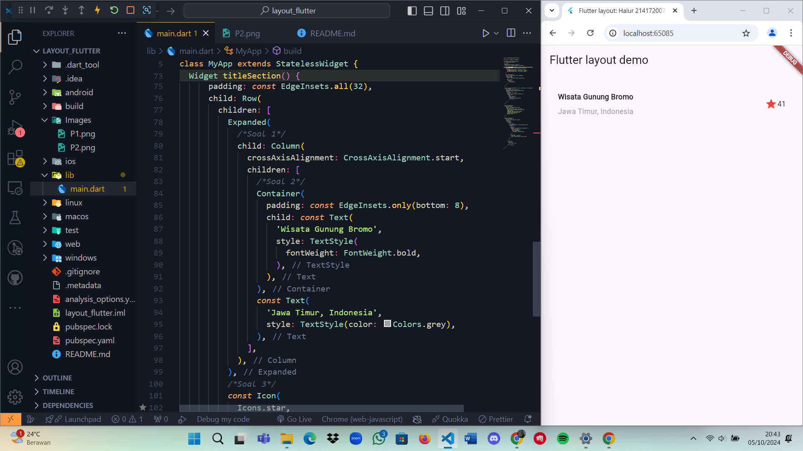
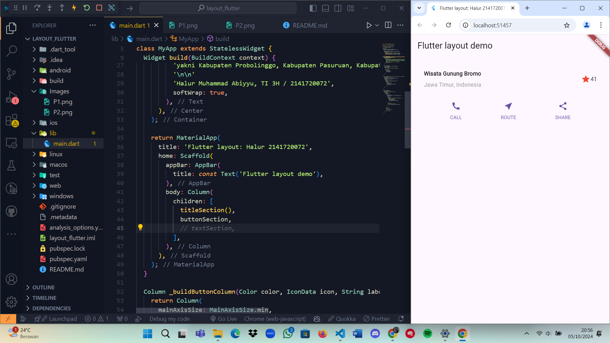
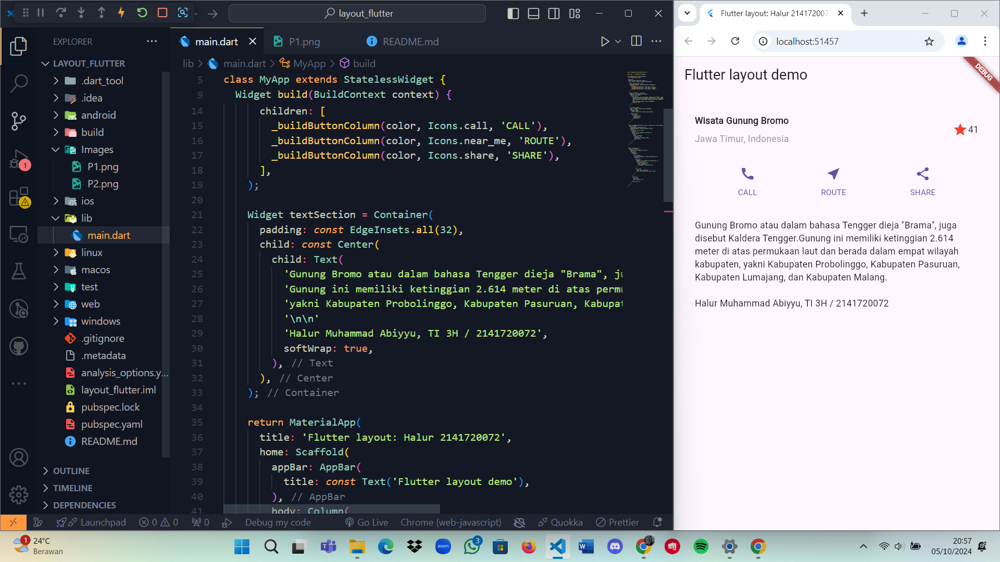
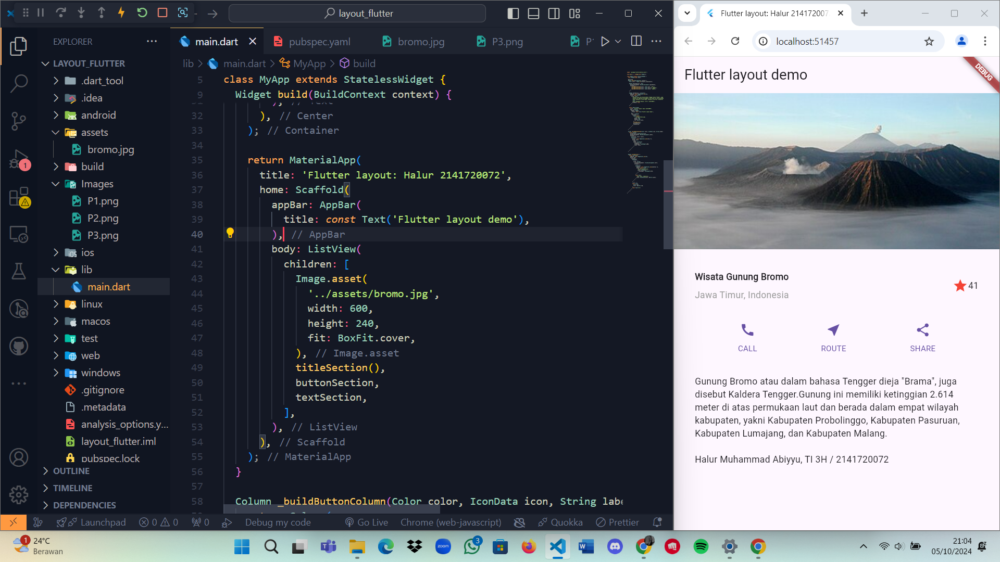

## Layout Flutter

Halur Muhammad Abiyyu <br>
2141720072 <br>
TI 3H <br>

### Praktikum 1

```dart
Widget titleSection() {
    return Container(
      padding: const EdgeInsets.all(32),
      child: Row(
        children: [
          Expanded(
            /*Soal 1*/
            child: Column(
              crossAxisAlignment: CrossAxisAlignment.start,
              children: [
                /*Soal 2*/
                Container(
                  padding: const EdgeInsets.only(bottom: 8),
                  child: const Text(
                    'Wisata Gunung di Batu',
                    style: TextStyle(
                      fontWeight: FontWeight.bold,
                    ),
                  ),
                ),
                const Text(
                  'Batu, Malang, Indonesia',
                  style: TextStyle(color: Colors.grey),
                ),
              ],
            ),
          ),
          /*Soal 3*/
          const Icon(
            Icons.star,
            color: Colors.red,
          ),
          const Text('41')
        ],
      ),
    );
  }
```

Hasil <br>

<br>

### Praktikum 2
Menambahkan button section row pada aplikasi <br>


### Praktikum 3
Menambahkan text section pada aplikasi <br>


### Praktikum 4
Menambahkan asset berupa gambar pada aplikasi <br>


### Tugas 1
[Repo Tugas 1](https://github.com/halurabiyyu/basic_layout_flutter)

